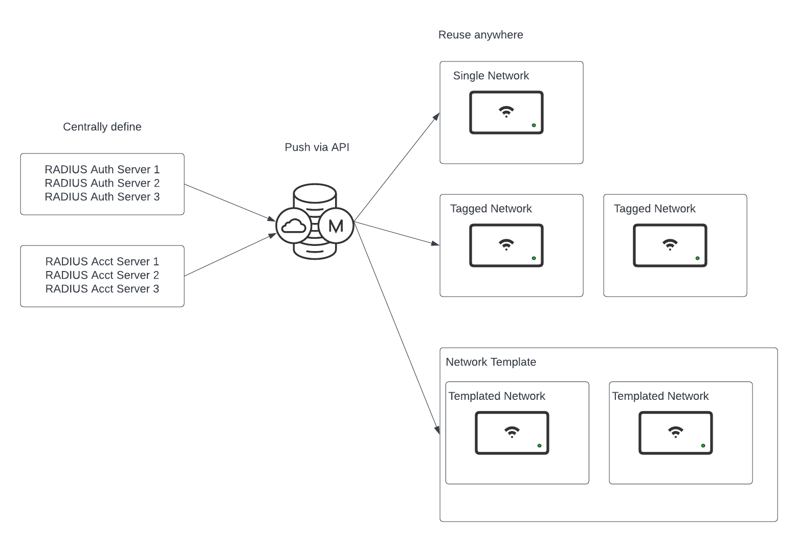
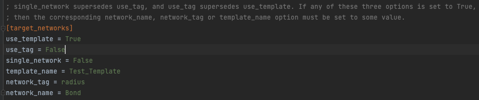
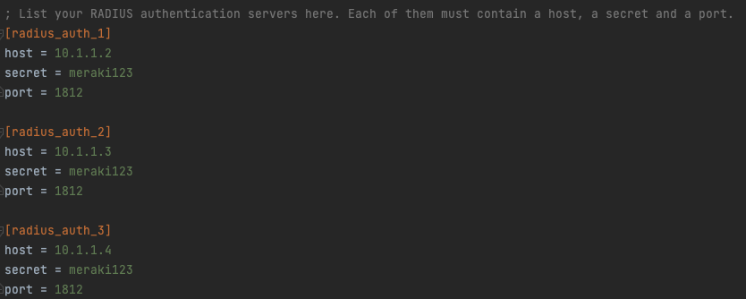
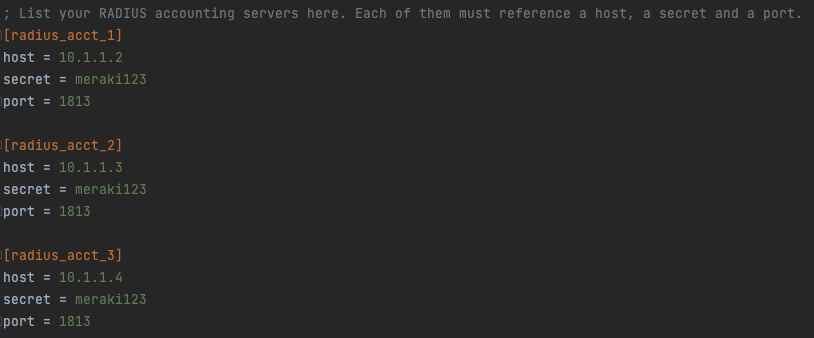
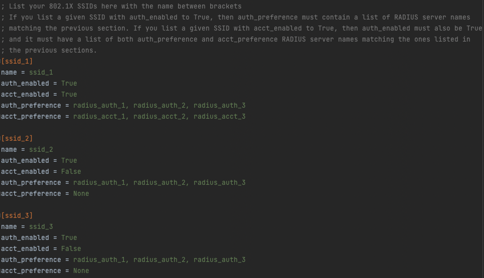

# merakiRadiusObjects
Define RADIUS Server Objects to be reused across an organization's SSIDs.

# Table of Contents

[Introduction](#intro)
[Prerequisites](#prereq)
[How to Use](#howtouse)

# Introduction

This tool allows creating a configuration file with a list of SSIDs that need 802.1X-RADIUS configuration, a list of RADIUS authentication and RADIUS accounting servers, and a preference order for these servers in the SSIDs, which will then be propagated to your SSIDs in one of 3 methods:

* Single Network: Will provision any SSIDs matching the exact names defined in your configuration file, and will overwrite the RADIUS settings in them accordingly
* Tag-based: Will provision all networks tagged with a user-defined tag with any SSIDs matching the exact names defined in your configuration file, and will overwrite the RADIUS settings in them accordingly
* Template-based: Will provision a specified configuration template with any SSIDs matching the exact names defined in your configuration file, and will overwrite the RADIUS settings in them accordingly

## Prerequisites

1. Active Cisco Meraki subscriptions in the orgs where the script will be run
2. API access enabled for these organizations, as well as an API Key with access to them. See how to enable [here](https://documentation.meraki.com/General_Administration/Other_Topics/Cisco_Meraki_Dashboard_API)
3. A working Python 3.0 environment
4. Install libraries in `requirements.txt`
5. Create SSIDs in the single-network, tagged-networks or configuration template that will exist in your Configuration file
6. Tag any networks you want to operate on with a user defined tag
7. Run the script

## How to Use

1. Clone repo to your working directory with `git clone https://github.com/Francisco-1088/merakiRadiusObjects.git`
2. Edit `config.ini`
* Add your API Key under `api_key` in line 2
* Add the Organization ID of the organization where you want to operate. You can find your Org ID easily by right clicking anywhere in the screen while logged in to your organization, and clicking "View Page Source". In the resulting page use "Find" to look for the keyword `Mkiconf.org_id`

* Under `[target_networks]` set only one of the options `use_template`, `use_tag` or `single_network` to `True`, and all others to `False`
* Specify `template_name`, `network_tag` or `network_name` accordingly (i.e. if choosing `use_tag` as `True`, then specify a `network_tag` to follow
* The specified names must match exactly the names of these networks, templates or tags in Dashboard
* If choosing to use tags, go ahead and tag your desired networks in Dashboard with the user defined tag

* For each RADIUS authentication server you need to use, create an entry in the form `[radius_auth_X]`, where `X` is a unique number (you can reuse the existing 3 in the sample file, and remove any unneeded ones). You may define as many as you need. Each of these must have an entry for `host`, which should be an IPv4 address, `secret` and `port`

* For each RADIUS accounting server you need to use, create an entry in the form `[radius_acct_X]`, where `X` is a unique number (you can reuse the existing 3 in the sample file, and remove any unneeded ones). You may define as many as you need. Each of these must have an entry for `host`, which should be an IPv4 address, `secret` and `port`

* For each SSID you intend to modify, create an entry in the form `[ssid_X]`, where `X` should be a unique number. Each of these must contain a `name`, a setting for `auth_enabled` (whether to use RADIUS authentication), a setting for `acct_enabled` (whether to use RADIUS accounting), a setting for `auth_preference` which should be a comma separated ordered list of RADIUS authentication servers referencing those listed in the RADIUS Auth section, and a setting for `acct_preference` which should be a comma separated ordered list of RADIUS authentication servers referencing those listed in the RADIUS Auth section

* The SSIDs must have `auth_enabled` set to `True`, but `acct_enabled` may be set to `True` or `False`. If `acct_enabled` is set to True, then `acct_preference` cannot be set to None

* The script will parse your configuration file and determine the list of `target_networks` it needs to operate on, depending on your settings

* It will then iterate through all of your networks and prompt you when it needs to modify or overwrite settings

* The prompts only accept 'Y' or 'N', anything else will be interpreted as a negative input and the section will be skipped

* The script will ONLY modify the RADIUS configuration of the SSID. If an SSID without WPA Enterprise configuration is chosen, the script will ask if you wish to set that SSID to WPA2 Enterprise, but all other settings will be preserved

* SSID names, Network Names, Tag Names and Template Names MUST match exactly what you define in your configuration file for the script to work properly
